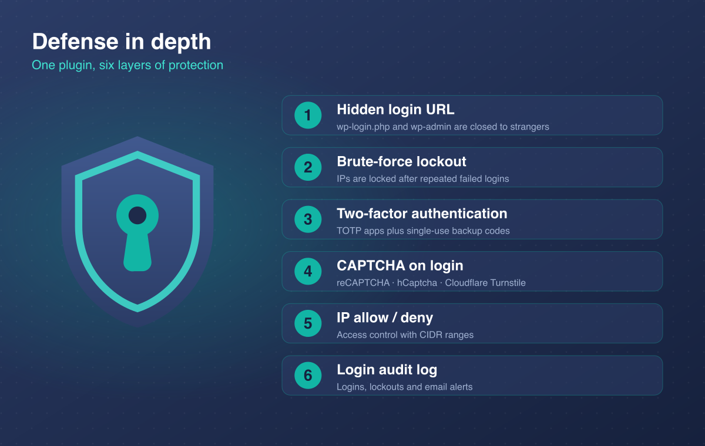
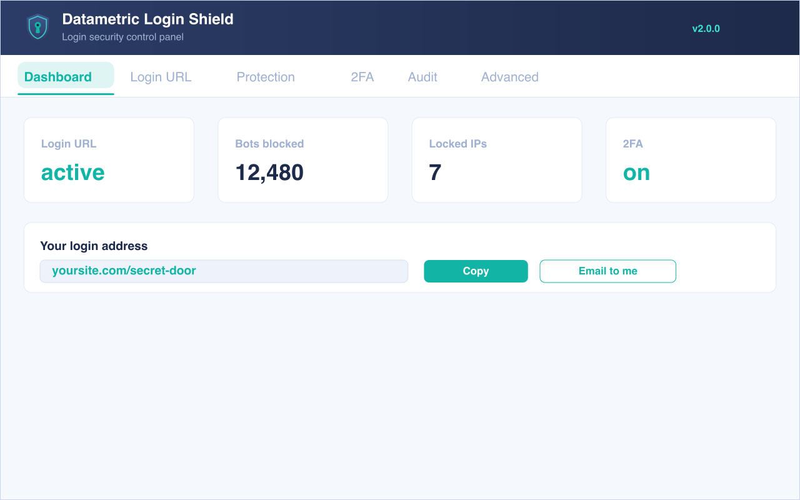
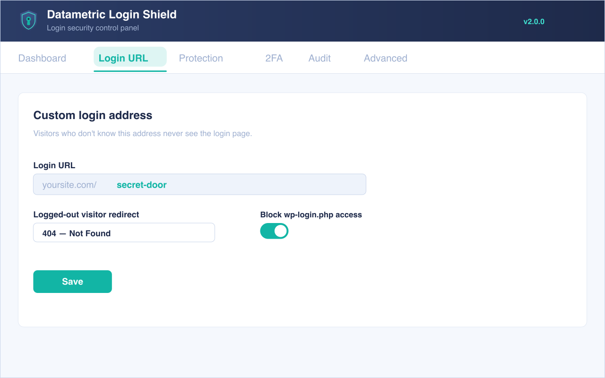
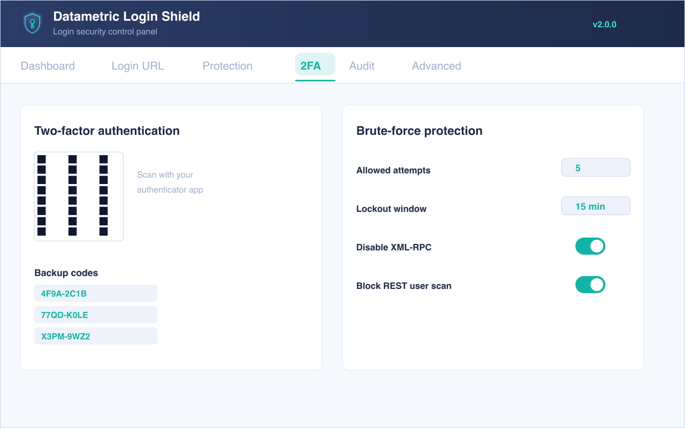
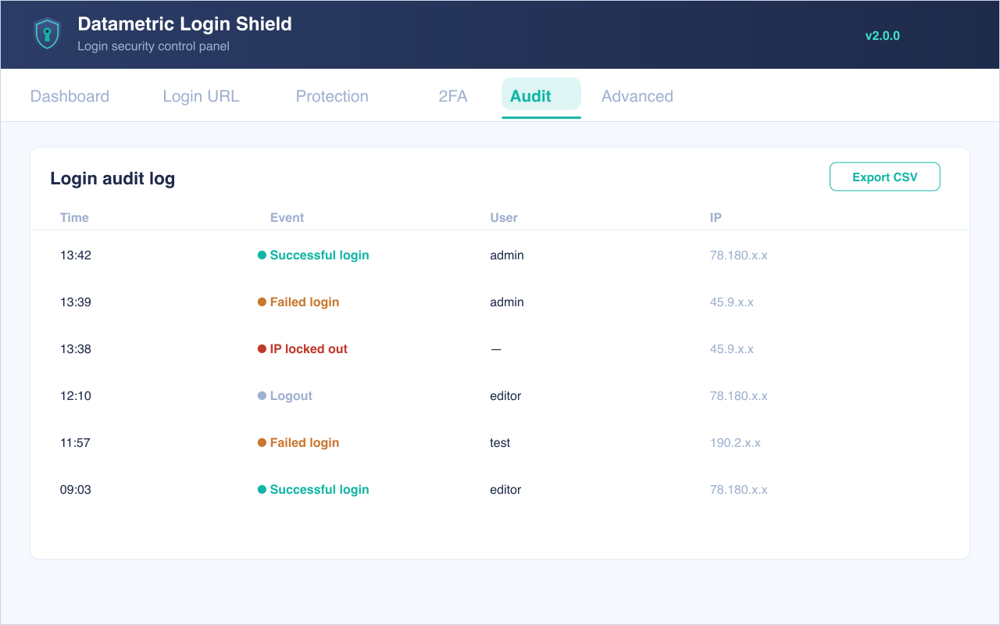

<p align="center">
  
</p>

<h1 align="center">Datametric Login Shield</h1>

<p align="center">
  Hide your WordPress login URL and lock down access — a modular login-security plugin by <strong>Datametric</strong>.
</p>

<p align="center">
  
  
  
  
  
</p>

<p align="center">
  📖 <a href="https://www.ridvanbilgin.com/2026/07/how-to-hide-your-wordpress-login-url.html">Read the full guide</a>
  &nbsp;·&nbsp; 🌐 <a href="https://www.datametric.rs/">Datametric</a>
  &nbsp;·&nbsp; 🐛 <a href="https://github.com/yonetici/datametric-login-shield/issues">Report an issue</a>
</p>

> A rebranded, hardened fork of [WPS Hide Login](https://wordpress.org/plugins/wps-hide-login/) (GPLv2 or later), originally created by WPServeur, NicolasKulka and wpformation. The core login-interception logic is derived from that project. Independent fork — not affiliated with or endorsed by the original authors. See **Credits** in [`readme.txt`](readme.txt).

## Why

Every WordPress site ships with the same front door — `wp-login.php` — so it's the most-attacked URL on the web, hammered by automated bots that never had to find it. Hiding that door removes you from the untargeted flood; the rest of the plugin stops the attackers a hidden URL alone can't. That's defense in depth, and **every layer below is free**.

<p align="center">
  
</p>

## Features (all free)

- **Hide login URL** — change `wp-login.php` to a custom, hard-to-guess address; return a 404 (configurable) for `wp-login.php` / `wp-admin` to logged-out visitors. No core-file edits, no rewrite rules — works on any host and fully reverts on deactivation.
- **Brute-force protection** — lock out an IP after too many failed logins (configurable threshold + window), with an allowlist and fail-open safety so a glitch can never bar every user.
- **Two-factor authentication** — optional TOTP (Google Authenticator, Authy, 1Password) with single-use backup codes and per-role enforcement.
- **IP allow / deny lists** — restrict login to specific IPs or CIDR ranges, or block known-bad ones.
- **CAPTCHA on login** — Google reCAPTCHA v2/v3, hCaptcha or Cloudflare Turnstile (optional; the only feature that makes an external call, and only when enabled).
- **Access hardening** — block REST user enumeration (`/wp/v2/users`), block `?author=N` scans, generic login errors, optional XML-RPC disable.
- **Login audit log** — successful/failed logins, lockouts and logouts with date, user and IP; configurable retention, CSV export, and optional email alerts on lockouts / admin logins.
- **Login-page branding** — logo, colours and custom CSS.
- **Modern admin panel** with copy / email-your-URL anti-lockout tools, plus emergency recovery constants (`DMLS_DISABLE_2FA`, `DMLS_DISABLE_IP_ACCESS`, `DMLS_DISABLE_CAPTCHA`).
- One-click import of an existing WPS Hide Login URL. Multisite compatible. Privacy-friendly — nothing leaves your server unless you enable CAPTCHA.

## Screenshots

| Dashboard | Login URL |
|---|---|
|  |  |
| **Two-factor & brute-force** | **Audit log** |
|  |  |

## Architecture

A small service container + module registry. Each feature is a `ModuleInterface` registered via the `dmls_register_modules` filter; a future **Pro** add-on plugs into the same filter and the `dmls_settings_tabs` registry without the free plugin referencing it.

```
datametric-login-shield.php   # bootstrap
src/
  Plugin.php  Container.php  Autoloader.php
  Contracts/ModuleInterface.php
  Support/    Options.php  Database.php  Ip.php  Totp.php  Singleton.php
  Admin/      SettingsPage.php  Settings.php
  Modules/    HideLogin/  BruteForce/  Hardening/  AuditLog/  AuditExtras/
              Totp/  Ip/  Captcha/  Branding/
assets/  languages/  readme.txt  uninstall.php
```

## Development

Requires PHP 7.2+ (CI runs 7.4).

```bash
composer install          # dev tools (PHPCS + WPCS + PHPCompatibility)
composer lint             # check WordPress coding standards
composer lint:fix         # auto-fix where possible
./build.sh                # produce dist/datametric-login-shield.<version>.zip
```

`.distignore` controls what is excluded from the shipped zip / WordPress.org SVN (e.g. `/.wordpress-org`, `/docs`, `/tests`, dev tooling).

## Continuous integration

- **CI** (`.github/workflows/ci.yml`) — runs PHP lint, PHPCS (WordPress standards) and the official **WordPress Plugin Check** on every push / PR.
- **Deploy** (`.github/workflows/deploy.yml`) — on pushing a version tag (e.g. `1.1.0`), deploys to the WordPress.org plugin directory via the [10up deploy action](https://github.com/10up/action-wordpress-plugin-deploy). Directory artwork (icon, banners, screenshots) ships from [`.wordpress-org/`](.wordpress-org).

### Releasing to WordPress.org (after the plugin is approved)

1. Add two repository secrets (Settings → Secrets and variables → Actions):
   - `SVN_USERNAME` — your WordPress.org username.
   - `SVN_PASSWORD` — your WordPress.org password.
2. Bump the version in `datametric-login-shield.php` (`Version:` header **and** `DMLS_VERSION`) and in `readme.txt` (`Stable tag`), and add a changelog entry.
3. Commit, then tag and push:
   ```bash
   git tag 2.0.0
   git push origin 2.0.0
   ```
   The deploy workflow tags the release in SVN and uploads a built zip artifact.

> The very first version must be submitted manually once via https://wordpress.org/plugins/developers/add/ and approved by the Plugin Review team before automated deploys can push updates.

## License

GPLv2 or later. See [`LICENSE`](LICENSE).
